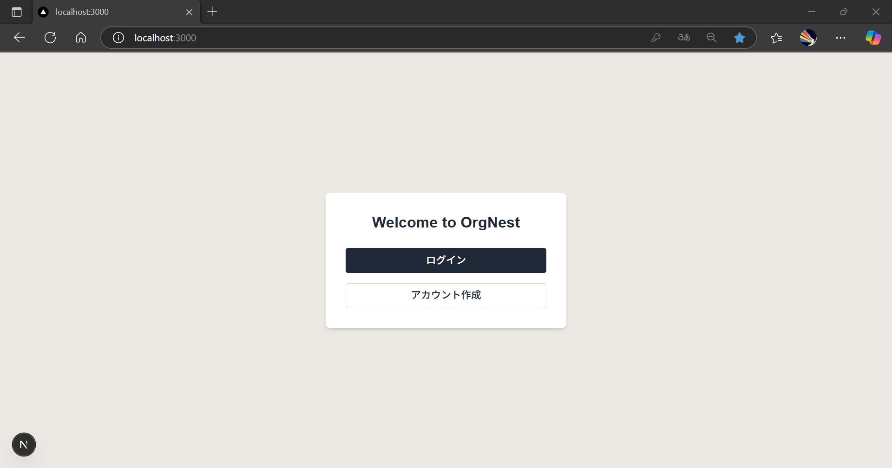
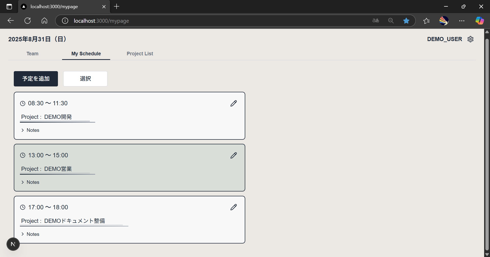
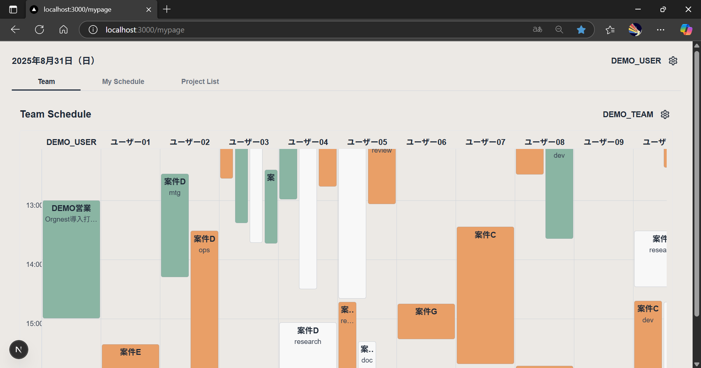

# OrgNest

小規模チーム向けの日次スケジュール管理アプリケーション（MVP版）です。  
PCブラウザでの操作性を重視しつつ、最低限のモバイル対応も行っています。

## デモ
- デプロイ先: https://orgnest.vercel.app  
- デモアカウント:  
  - user_id: demo_user
  - user_pass: demo0000
  - team_id: demo_team
  - team_pass: demo0000

## 主な機能
- ユーザー認証（登録・ログイン）  
- 1日の予定をカード形式で追加・編集  
- チームメンバー全員の予定を一覧できるタイムラインビュー  
- アカウント情報の更新（ユーザー名・連絡先など）  
- モーダルを利用したシンプルで統一された操作フロー  

## 技術スタック
- フロントエンド: Next.js (Pages Router), React, TypeScript  
- スタイリング: TailwindCSS, lucide-react  
- バックエンド: Supabase (PostgreSQL, 認証)  
- デプロイ: Vercel  

## 開発上の工夫
- スケジュールカード、タイムライン、モーダルなどを**再利用可能なコンポーネント**として設計  
- 利用者が迷わないよう、**シンプルで一貫した導線**を意識したUI設計  
  - 例: すべての操作をモーダルベースに統一し、どの場面でも同じ操作感で進められる  

## 今後の展望
- チーム内コメント機能  
- 週／月単位のスケジュールビュー  
- サブスクリプション課金機能（Stripe連携）  
- PWA化によるオフライン対応  

## スクリーンショット

### ログイン画面

### マイスケジュール編集

### チームタイムライン

